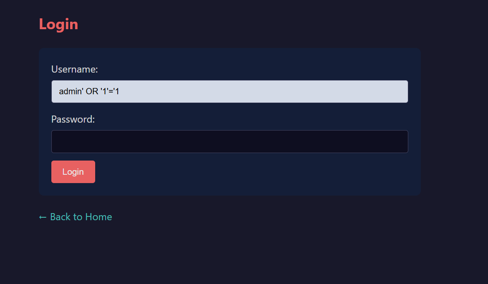
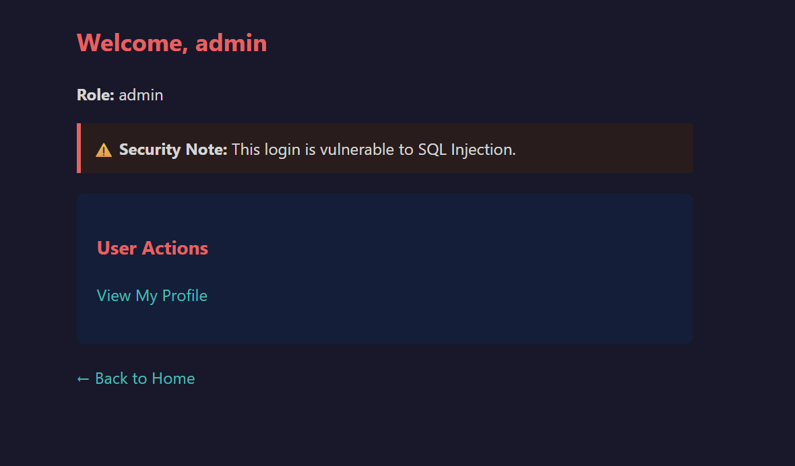
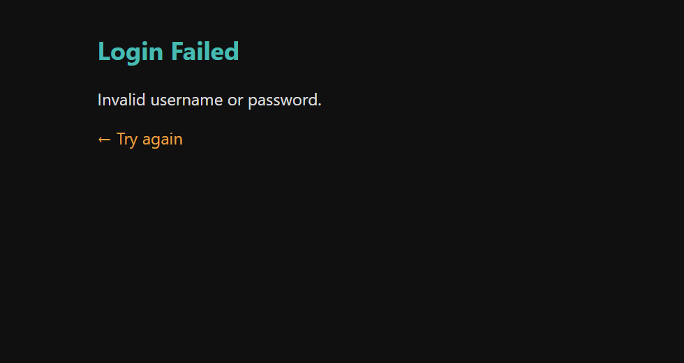
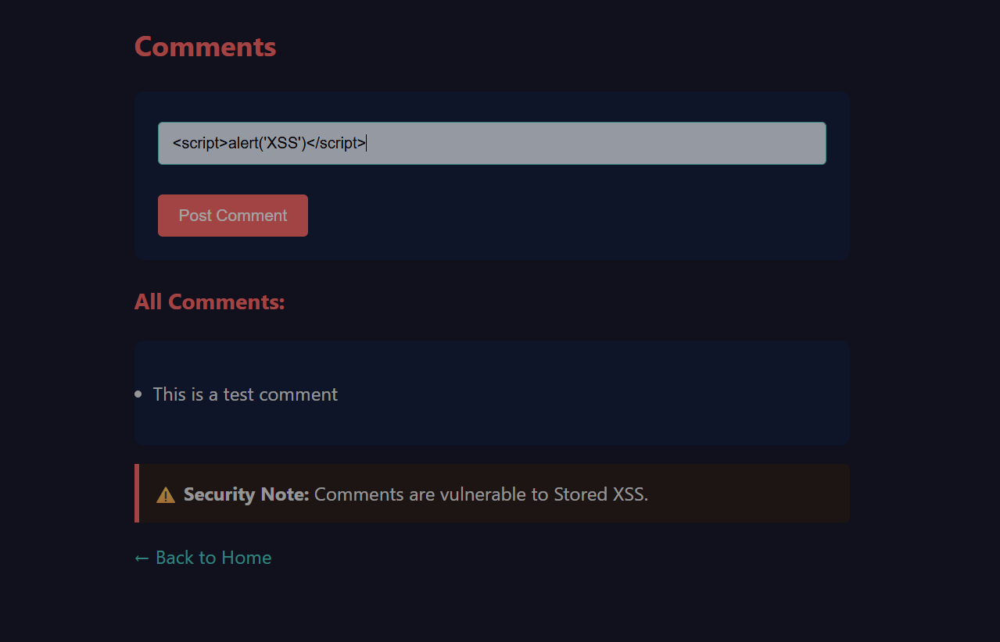
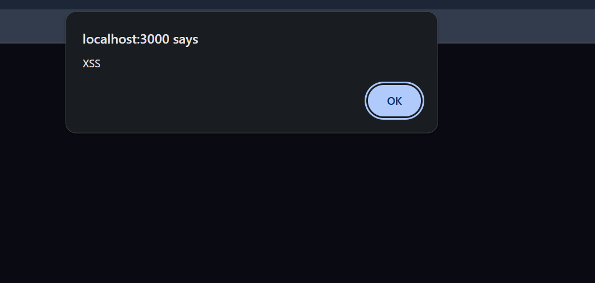
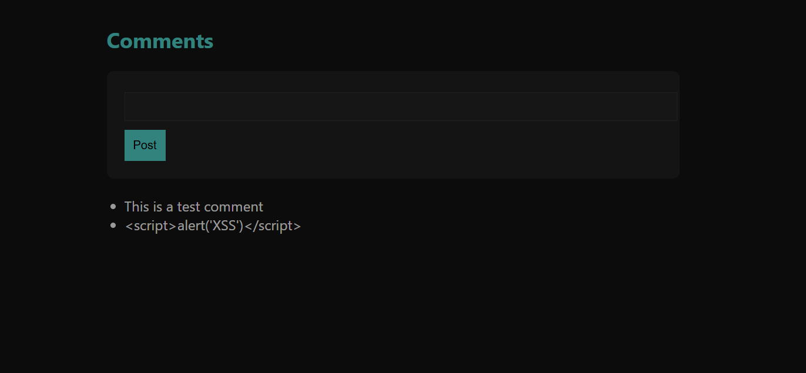
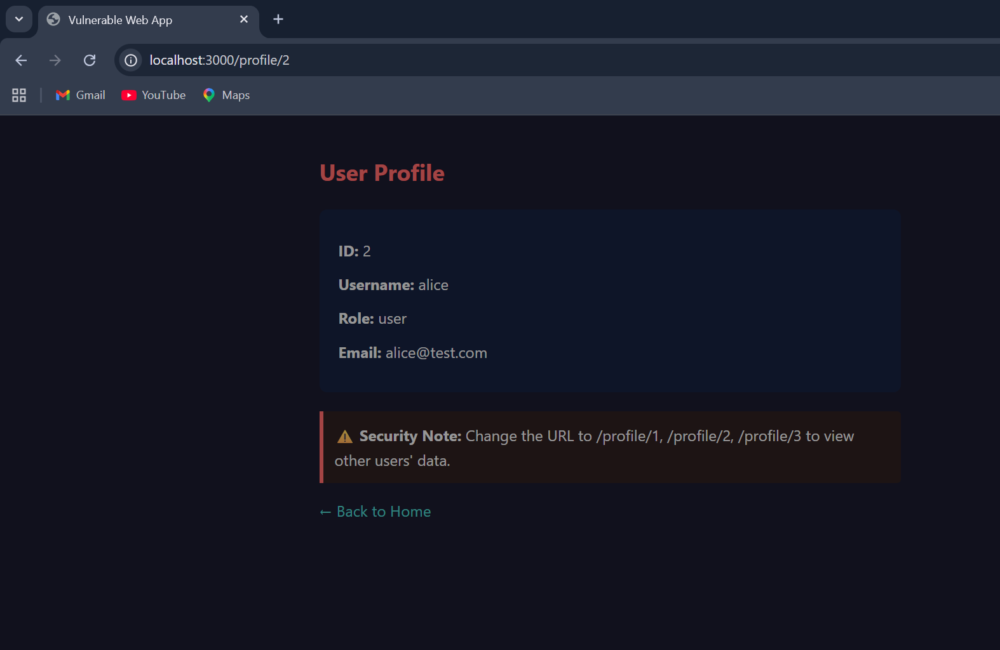
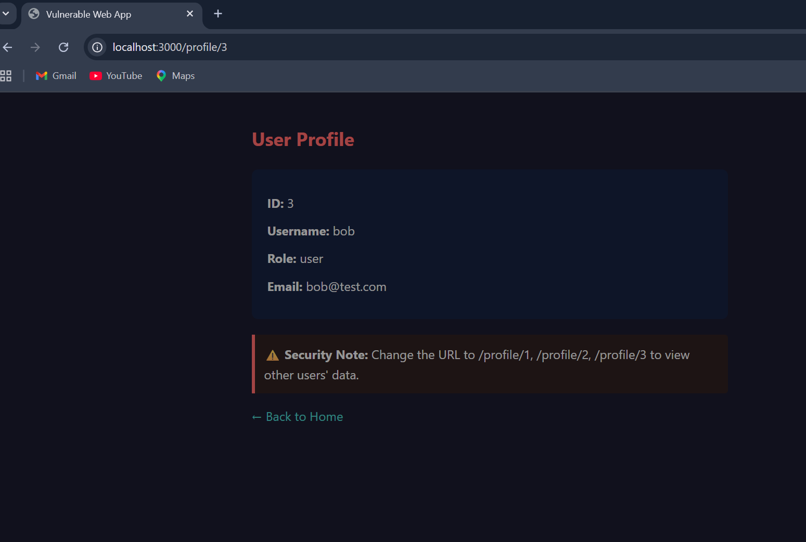
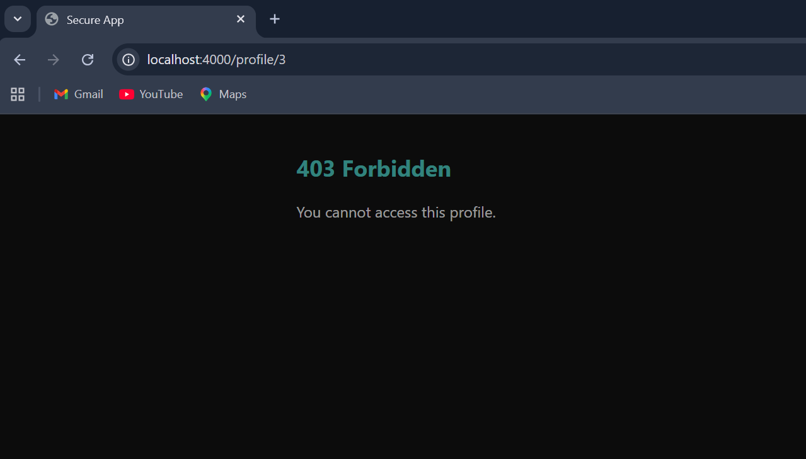

# SentinelWeb – Web Security Engineering Project

## Overview

SentinelWeb is a hands-on cybersecurity project demonstrating real-world web application vulnerabilities and their remediation, aligned with OWASP Top 10.

The project is divided into two environments:

- **Vulnerable Application** – intentionally insecure for attack simulation
- **Secure Application** – hardened version implementing proper defenses

This project highlights both offensive exploitation and defensive engineering.

---

## Key Features

### Vulnerable Application

- SQL Injection (authentication bypass)
- Stored Cross-Site Scripting (XSS)
- Insecure Direct Object Reference (IDOR)
- Weak authentication logic
- Unsanitized user input

### Secure Application

- Parameterized queries (SQLi prevention)
- Output encoding (XSS mitigation)
- CSRF protection (token-based)
- Secure session handling
- Rate limiting (brute-force protection)
- Authorization checks (IDOR prevention)
- Security headers via Helmet

---

## Tech Stack

- Node.js (Express.js)
- SQLite3
- bcrypt
- express-session
- csurf
- helmet
- express-rate-limit

---

## Vulnerability Demonstration

### 1. SQL Injection

#### Vulnerable

ser input is directly embedded into the SQL query, allowing authentication bypass.

**Malicious Payload Used:**

' OR '1'='1

📸 Payload Submission

📸 Successful Exploit (Authentication Bypass):

#### Secure

Parameterized queries are used to safely handle user input.

📸 📸 Same Payload Attempt (Blocked):

---

### 2. Stored Cross-Site Scripting (XSS)

#### Vulnerable

User input is stored and rendered without sanitization, allowing execution of arbitrary JavaScript in the browser.

**Malicious Payload Used:**

📸 Payload Submission

📸 Script Execution (Stored XSS Triggered):

#### Secure

User input is safely encoded before rendering, preventing script execution.

📸 Same Payload Rendered Safely:

---

### 3. IDOR (Broken Access Control)

#### Vulnerable

The application does not enforce proper authorization checks, allowing users to access other users data by modifying URL parameters.

📸 Normal Access (Own Profile):

📸 Exploitation via URL Manipulation:

#### Secure

Authorization checks ensure that users can only access their own resources.

📸 Unauthorized Access Blocked (403 Forbidden):

---

## Project Structure

SentinelWeb/
│
├── vulnerable/
├── secure/
├── assets/
└── README.md

---

## How to Run

### Vulnerable

cd vulnerable  
node init-db.js  
node index.js

### Secure

cd secure  
node seed.js  
node index.js

---

## Learning Outcomes

- Web vulnerability exploitation
- Secure coding practices
- OWASP Top 10 understanding
- Offensive + defensive mindset

---

## Author

Meet Dave  
Cybersecurity Graduate
